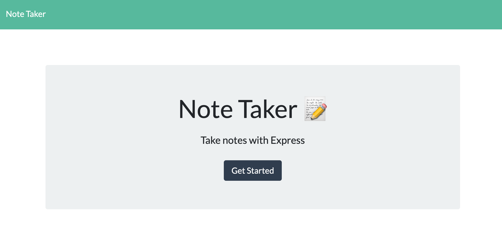
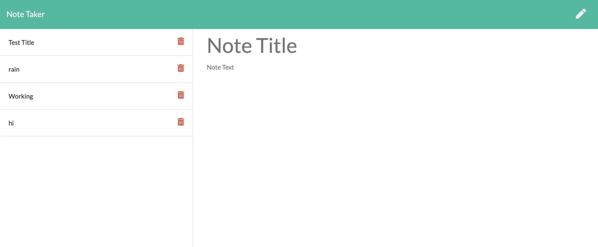
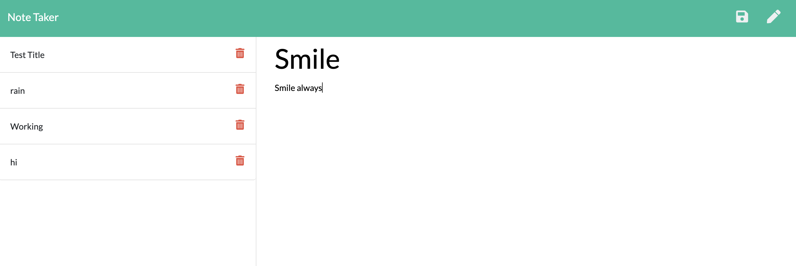
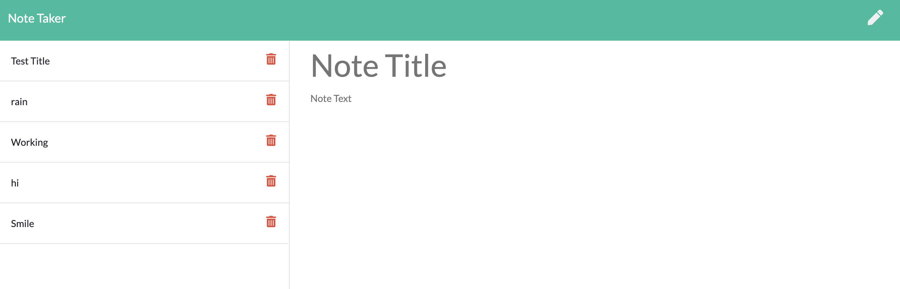

# Note Taker
## Description
This application allows the user to create, add, and delete notes. 

--- 
## How It Works
When you first click the link, you will come to a home page. Click the get started button. The notes are stored on the left side of the screen. Once the note title and the note information is listed, click the save button. Then it'll appear on the left side of the screen. To view a note, simply click on the note on the left side and it'll appear on the right side of the screen. To create a new note when a note is on the screen, click the pen in the top right corner. 

---

## Screenshots
When you click on the link, you will find this page. Click on the "Get Started" button to go to the note pages.

This is the initial look of the application when it is first opened.

Here, I'm creating a new note. You can see the save icon on the top right there.

The note was created and can be seen in the left column. Because no new note is being created, the save button is not visible.

---

## Link to deployed application
If you'd like to use this application, use the [Note Tracker](!https://peaceful-bayou-22212.herokuapp.com/) link.
